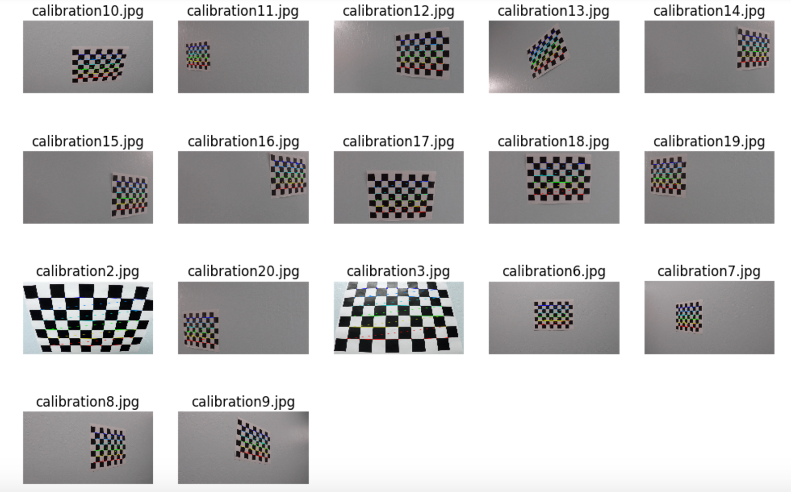

# SelfDrivingCar-P4-Advanced_LaneLines
Udacity CarND Project 4
## Advanced Lane Finding
[](http://www.udacity.com/drive)

The goals / steps of this project are the following:

* Compute the camera calibration matrix and distortion coefficients given a set of chessboard images.
* Apply a distortion correction to raw images.
* Use color transforms, gradients, etc., to create a thresholded binary image.
* Apply a perspective transform to rectify binary image ("birds-eye view").
* Detect lane pixels and fit to find the lane boundary.
* Determine the curvature of the lane and vehicle position with respect to center.
* Warp the detected lane boundaries back onto the original image.
* Output visual display of the lane boundaries and numerical estimation of lane curvature and vehicle position.

###Here I will consider the rubric points individually and describe how I addressed each point in my implementation.  

---

###Camera Calibration

####1. Briefly state how you computed the camera matrix and distortion coefficients. Provide an example of a distortion corrected calibration image.

The code for this step is contained in the first two code cells of the Jupyter notebook located in "./lanelines.ipynb" 

I start by preparing "object points", which will be the (x, y, z) coordinates of the chessboard corners in the world. I first find the corners of each calibration images. If there are 9x6 corners in the images.



Here I am assuming the chessboard is fixed on the (x, y) plane at z=0, such that the object points are the same for each calibration image.  Thus, `objp` is just a replicated array of coordinates, and `objpoints` will be appended with a copy of it every time I successfully detect all chessboard corners in a test image.  `imgpoints` will be appended with the (x, y) pixel position of each of the corners in the image plane with each successful chessboard detection.  

I then used the output `objpoints` and `imgpoints` to compute the camera calibration and distortion coefficients using the `cv2.calibrateCamera()` function.  I applied this distortion correction to the test image using the `cv2.undistort()` function and obtained this result: 


###Pipeline (single images)

####1. Provide an example of a distortion-corrected image.
To demonstrate this step, I will describe how I apply the distortion correction to one of the test images like this one:


####2. Describe how (and identify where in your code) you performed a perspective transform and provide an example of a transformed image.

Instead of creating a thresholded binary image, I first performed a perspective transform. This will make the creation of the binary image easier, since after the perspective transform, the lines will be almost vertical to the x-axis. 

The code for my perspective transform includes a function called `birds_eye_view()`, in the 6th code cell of the Jupyter notebook.  The `birds_eye_view()` function takes as inputs an image (`img`).  I chose the hardcode the source and destination points in the following manner:

```
    leftupperpoint  = [580,460]
    rightupperpoint = [740,460] 
    leftlowerpoint  = [280,680]
    rightlowerpoint = [1050,680] 

    src = np.float32([leftupperpoint, leftlowerpoint, rightupperpoint, rightlowerpoint])
    dst = np.float32([[200,0], [200,680], [1000,0], [1000,680]])
```
This resulted in the following source and destination points:

| Source        | Destination   | 
|:-------------:|:-------------:| 
| 580, 460      | 200, 0        | 
| 280, 680      | 200, 680      |
| 740, 460      | 1000, 0       |
| 1050, 680     | 1000, 680     |

I verified that my perspective transform was working as expected by drawing the `src` and `dst` points onto a test image and its warped counterpart to verify that the lines appear parallel in the warped image.


####3. Describe how (and identify where in your code) you used color transforms, gradients or other methods to create a thresholded binary image.  Provide an example of a binary image result.
I used a combination of color and gradient thresholds to generate a binary image.
The code for my binary transform includes a function called `binary_transform()`, in the 7th code cell of the Jupyter notebook.  The `binary_transform()` function takes as inputs an image (`img`), as well as the kernel size of `sobel` (`sobel_kernel=3`), the color thresholds (`sc_thresh=(110, 255)`), and the x direction gradient threshold (`sx_thresh=(20, 100)`).  
Here's an example of my output for this step.  


####4. Apply a Region Mask to the Binary Images
From the previous output, we can find that, the noise of other cars on the side lane may show up in the binary images. which will affect the following polynomial fitting. Therefore, I choose to add a region mask to the binary image in order the cut off the noise on the size lane. 
The code for my region mask includes a function called `region_of_interest()`, in the 8th code cell of the Jupyter notebook.  The `region_of_interest()` function takes as inputs an image (`img`) as well as the `vertices` which defines the region of interest.  
Here's an example of my output for this step. 


####4. Describe how (and identify where in your code) you identified lane-line pixels and fit their positions with a polynomial?

I identify and fit my lane lines with a 2nd order polynomial in the function `findlines()`, which can be found in the 10th code cell of the Jupyter notebook. The method I am using is "sliding window" method introduced in the class. Here's an example of my output for this step. 


####5. Describe how (and identify where in your code) you calculated the radius of curvature of the lane and the position of the vehicle with respect to center.

I also calculate the radius of curvature of the lane and the position of the vehicle with respect to center the function `findlines()`, by using `np.polyfit`. After getting the radius, I can find the center of the lane, then the position of the car can be easily computed.


####6. Provide an example image of your result plotted back down onto the road such that the lane area is identified clearly.

I plot my result back down onto the road such that the lane area is identified clearly in the function `to_real_world_scale()`, which can be found in the 12th code cell of the Jupyter notebook.


---

###Pipeline (video)

####1. Pipeline of the image processing
The pipeline of the image processing can be found in `process_image(input_image)`, which is in the 15th code cell of the Jupyter notebook.
Here's an example of my output for each frame of the video. 


####1. A link to your final video output.  

Here's a [link to my video result](https://youtu.be/O91HjPI2B9M)

---

###Discussion

####1. Briefly discuss any problems / issues you faced in your implementation of this project.  Where will your pipeline likely fail?  What could you do to make it more robust?

Here I'll talk about the approach I took, what techniques I used, what worked and why, where the pipeline might fail and how I might improve it if I were going to pursue this project further.  

